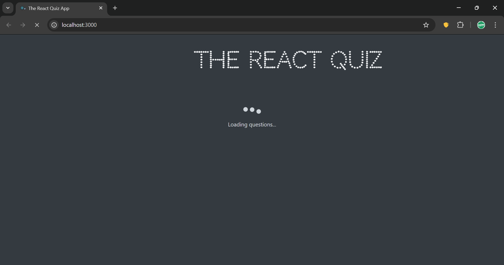
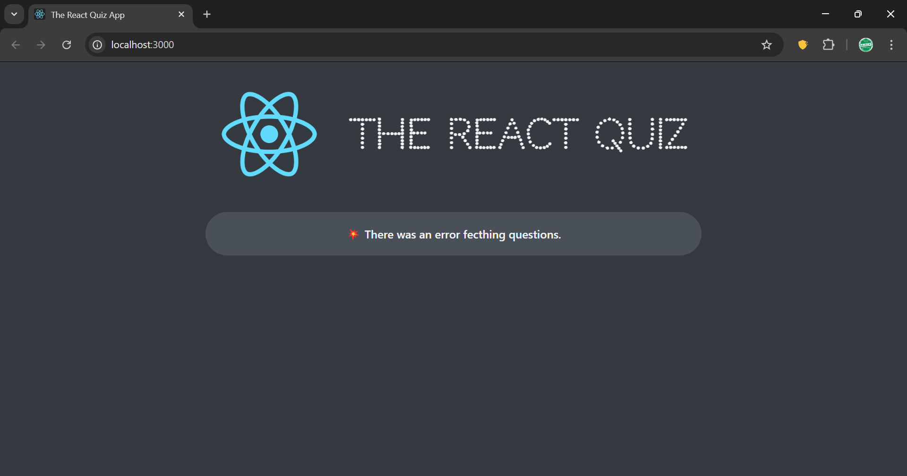
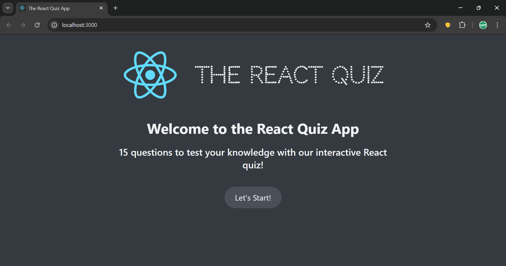
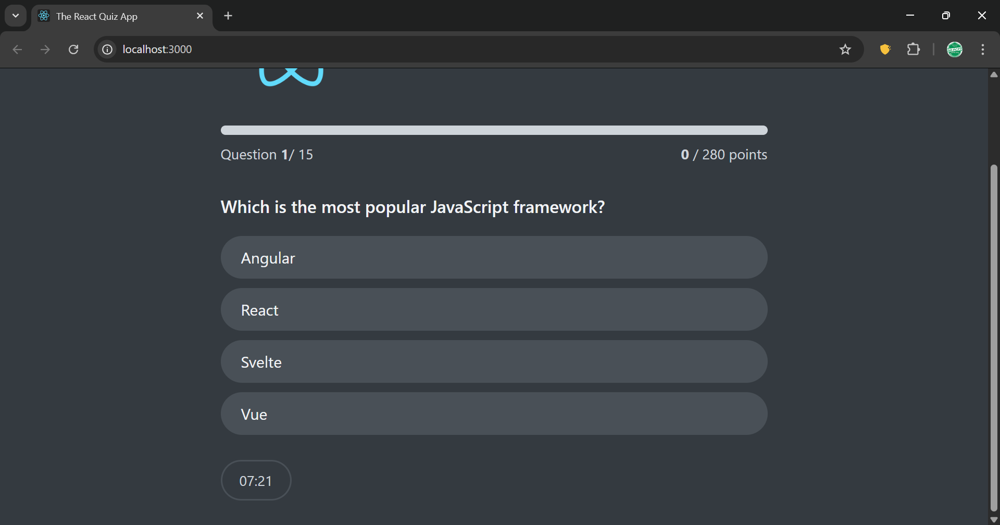
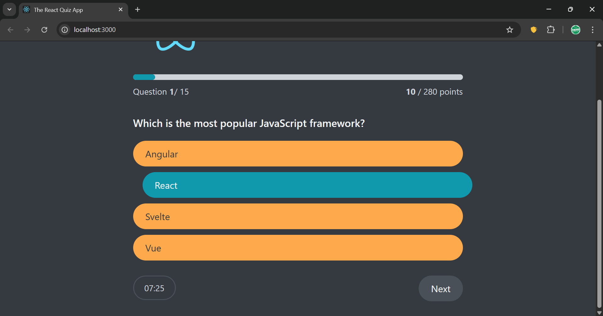
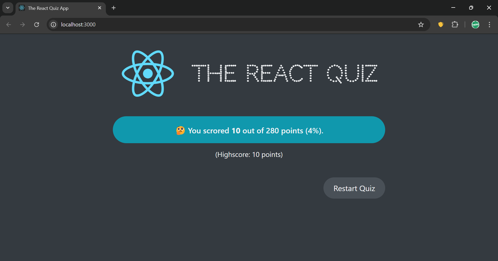

# React Quiz App

An interactive quiz app built with React.

The app fetches quiz questions from a local JSON API, tracks points and high score, shows progress, and includes a countdown timer for the full quiz session.

## Features

- Loads questions from a local API powered by json-server.
- Start screen with total number of available questions.
- One question at a time with multiple options.
- Real-time scoring based on correct answers.
- Progress indicator and maximum score tracking.
- Quiz timer with automatic finish when time runs out.
- Final screen with score, percentage, and restart action.

## Tech Stack

- React
- useReducer for state management
- json-server for mock API
- Create React App tooling

## Project Structure

```text
quiz-app/
├── data/
│   └── questions.json
├── public/
│   └── index.html
├── src/
│   ├── components/
│   │   ├── DateCounter.js
│   │   ├── Error.jsx
│   │   ├── FinishedScreen.jsx
│   │   ├── Footer.jsx
│   │   ├── Header.jsx
│   │   ├── Loader.jsx
│   │   ├── Main.jsx
│   │   ├── NextButton.jsx
│   │   ├── Options.jsx
│   │   ├── Progress.jsx
│   │   ├── Question.jsx
│   │   ├── StartScreen.jsx
│   │   └── Timer.jsx
│   ├── App.jsx
│   ├── index.css
│   └── index.js
├── package.json
└── README.md
```

## Screenshots













## Getting Started

### 1. Install dependencies

```bash
npm install
```

### 2. Start the questions API (json-server)

```bash
npm run server
```

The API runs at:

http://localhost:8000/questions

### 3. Start the React app

```bash
npm start
```

The app runs at:

http://localhost:3000

## Available Scripts

- npm start: Run the app in development mode.
- npm run server: Run json-server for quiz questions.
- npm test: Run tests in watch mode.
- npm run build: Build production output.

## Current App Flow

1. App loads and fetches questions.
2. User starts the quiz.
3. User answers question-by-question.
4. App updates points, progress, and timer.
5. Quiz ends when user finishes or timer reaches zero.
6. Final score and high score are shown, with a restart option.

## Future Development

- Allow users to choose the number of questions on the start screen.
- Add difficulty filters (easy, medium, hard) before quiz start.
- Persist high score in an API and fetch it after refresh to compare against new results.
- Store user answers in an array to enable both forward and backward navigation.

## Notes

- This project currently uses a local mock API for question data.
- High score is currently managed in local app state during a session.
